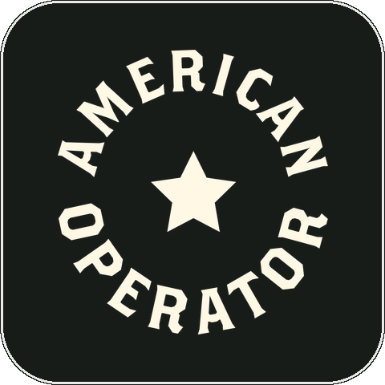
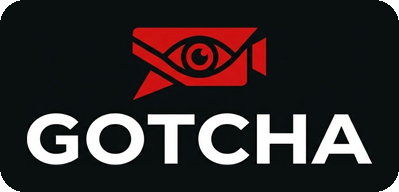

<h1 align="center">JASON LEE</h1>

Hi! I'm a CS and math student at the University of Maryland. I like using my passion for coding to make the world a better place :D

<a href="https://jasonslee.com">jasonslee.com</a> · <a href="https://www.linkedin.com/in/lee-s-jason">LinkedIn</a> · jasonlee131045@gmail.com

## Experience

<table>
  <tr>
    <td width="84" align="center" valign="top"></td>
    <td valign="top">
      <strong>American Operator</strong> · AI Engineer Intern
      <ul>
        <li>Deployed a full-stack TypeScript KPI dashboard (React, serverless API, Postgres) replacing a manual weekly spreadsheet for portfolio ops</li>
        <li>Shipped Inngest pipelines syncing BigQuery metrics to a live dashboard and weekly KPI emails to leadership, replacing manual reporting</li>
        <li>Automated accounts payable end-to-end with an AI pipeline that reads invoice PDFs, matches costs to jobs, and files Knowify bills daily</li>
      </ul>
    </td>
  </tr>
</table>

<table>
  <tr>
    <td width="84" align="center" valign="top"></td>
    <td valign="top">
      <strong>Easy Dynamics</strong> · Software Engineer Intern
      <ul>
        <li>Designed and built an IT service desk agent in Copilot Studio, trained on SharePoint libraries, to resolve common employee IT questions</li>
        <li>Created Power Automate flows and OAuth 2.0 (3LO) custom connectors to implement automated ticket creation to Jira's API</li>
        <li>Developed an Azure Blob to store Jira tickets, used PowerShell scripting to automate uploading ticket JSON contents and attachments</li>
        <li>Achieved a 27% automated resolution rate and reduced average response time from 24 hours to under 10 seconds</li>
      </ul>
    </td>
  </tr>
</table>

<table>
  <tr>
    <td width="84" align="center" valign="top"></td>
    <td valign="top">
      <strong>First-Year Innovation &amp; Research Experience</strong> · Quantum ML Undergraduate Researcher
      <ul>
        <li>Researched quantum Wasserstein GANs for high-resolution image generation, evaluating FRQI states and task-specific inductive biases</li>
        <li>Applied the ImageQGANS codebase to replicate published results, cross-referencing state vector simulations with generated figures</li>
      </ul>
    </td>
  </tr>
</table>

<table>
  <tr>
    <td width="84" align="center" valign="top"></td>
    <td valign="top">
      <strong>Panda Programmer</strong> · Computer Science Instructor
      <ul>
        <li>Mentored 50+ K-8 students in Scratch, Python, JavaScript, HTML, CSS, and robotics through hands-on programming projects</li>
        <li>Presented lessons on data structures, control flow, event-driven processing, serial and parallel execution, and animation</li>
      </ul>
    </td>
  </tr>
</table>

## Projects

<table>
  <tr>
    <td width="84" align="center" valign="top"></td>
    <td valign="top">
      <strong><a href="https://github.com/jasonslee07/redress">Redress</a></strong>
      <ul>
        <li>Built a full-stack React and TypeScript app where an AI agent helps citizens file complaints and pushes government agencies to respond</li>
        <li>Designed the agent to automatically route cases to the appropriate city office and email agencies via AgentMail, escalating if one stalls</li>
        <li>Kept a human in control with an approval step before anything sends, and gave citizens real-time text updates via Linq on every case</li>
      </ul>
    </td>
  </tr>
</table>

<table>
  <tr>
    <td width="84" align="center" valign="top"></td>
    <td valign="top">
      <strong><a href="https://github.com/jasonslee07/sell4impact">Sell4Impact</a></strong>
      <ul>
        <li>Developed a React (TypeScript) dorm marketplace with Tailwind CSS, Firebase Auth &amp; Firestore to deliver real-time data synchronization</li>
        <li>Built the Client and Vendor roles with custom dashboards, enabling users to manage dynamic inventory, track orders, and edit profiles</li>
        <li>Implemented an active cart system, live search filtering, and Firebase Storage integration for secure user image upload handling</li>
      </ul>
    </td>
  </tr>
</table>

<table>
  <tr>
    <td width="84" align="center" valign="top"></td>
    <td valign="top">
      <strong>Gotcha!</strong>
      <ul>
        <li>Built a real-time shoplifting detection app using React (TypeScript), Flask, and Roboflow to analyze video and flag suspicious behavior</li>
        <li>Engineered a synchronized API pipeline (Gemini, ElevenLabs, Twilio) via ngrok to trigger automated, descriptive emergency phone calls</li>
      </ul>
    </td>
  </tr>
</table>
